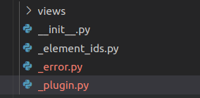

# Building a plugin for visualizing population data

It's no secret that the human world population has been continuosly growing in the last 60 year, reaching a total number of almost 7.8 billion in 2020.


(Source: https://www.worldometers.info/world-population/world-population-by-year/ [2022-06-03])

However, it is rather unknown how this population is distributed over different countries, age groups, gender and urban and rural areas. Moreover, have you ever wondered how high the birth and mortality rate is? What the life expectancy is depending on country and gender?

In this tutorial, we are going to create a Webviz plugin using the new Webviz Layout Framework (WLF) that lets us dive deeper into this topic. As a data source we are going to use the World Bank's 2022 `Population Estimates And Projections` data collection (https://datacatalog.worldbank.org/search/dataset/0037655/Population-Estimates-and-Projections).

## Analyzing the data source

In order to get started, let's have a look at the data source. We have a set of indicators for both areas and single countries in the world with data series from 1960 to 2050. In addition, we also have all those indicators for the whole world. In order to make the plugin less complicated, let's not take into account areas and just concentrate on single countries and the overall world's values.

Let's have a look at the indicators:

-   Age dependency ratio (young, old, % of working-age population)
-   Age population interpolated (male/female, 0-25 years)
-   Birth, death and fertility rates
-   Life expectancy at birth (male/female/total)
-   Mortality rates
-   Net migration
-   Number of deaths
-   Population ages (0-80+, absolute and relative values)
-   Population growth (annual %)
-   Population (male/female/total)
-   Probability of dying among adolescents
-   Rural and urban population (absolute/relative/annual growth)
-   Sex ratio at birth (male births per female births)

Since we don't want to blow up our plugin too much (and not all indicators come with data for each country), we are only going to have a look at the following indicators. Moreover, we are going to categorize them as follows:

-   Birth, death, fertility and life expectancy
    -   Birth indicators
        -   Birth and fertility rates
        -   Life expectancy at birth (male/female/total)
        -   Sex ratio at birth (male births per female
    -   Mortality and death rates
-   Population
    -   Population by ages
        -   Population ages (0-80+, absolute and relative values)
    -   Population indicators
        -   Population growth (annual %)
        -   Population (male/female/total)
        -   Rural and urban population (absolute/relative/annual growth)

The CSV file from the World Bank was adjusted accordingly by removing all unnecessary data.

## Sketching the plugin

After having analyzed the data source, let's start sketching our plugin. We decided to look at a certain set of indicators and we grouped them together. We have two main categories, each of them having two sub categories. In WLF, these categories of indicators can be regarded as different views on the data source. That's why we are going to implement two view groups and four views.


## Implementing the plugin

### Initial setup

Let's get started implementing the plugin. The most important part in the beginning is the structure. A good practice is to create a folder for all the views and one file for storing all the elements' IDs. In addition, we create our `_plugin.py` and `__init__.py`s file (one inside the main and one in the `views` folder).


### Plugin file

Let's have a look at our `_plugin.py` file. This is going to be the heart and brain of our plugin. It defines the input, imports our data and creates the views and settings. We start with a basic implementation that gives a description and handles the data import.

```python
from typing import Optional, Type, Union
from pathlib import Path

import pandas as pd
from webviz_config import WebvizPluginABC
from dash.development.base_component import Component

from ._error import error

class PopulationAnalysis(WebvizPluginABC):
    """
    This Webviz plugin is serving as a demonstration of how to utilize the new Webviz Layout Framework.
    Step by step, it is created in the respective tutorial: MISSING LINK.

    `Plugin functionality`:
    This plugin imports population data from the World Bank's 2022 `Population Estimates And Projections`
    data collection (https://datacatalog.worldbank.org/search/dataset/0037655/Population-Estimates-and-Projections)
    as a CSV file.
    It provides two view groups with two views each on the data:
    -   Birth, death, fertility and life expectancy
        -   Birth indicators
            -   Birth and fertility rates
            -   Life expectancy at birth (male/female/total)
            -   Sex ratio at birth (male births per female
        -   Mortality and death rates
    -   Population
        -   Population by ages
            -   Population ages (0-80+, absolute and relative values)
        -   Population indicators
            -   Population growth (annual %)
            -   Population (male/female/total)
            -   Rural and urban population (absolute/relative/annual growth)

    `Plugin file structure:`
    * _element_ids - Containing element IDs for all elements
    """

    def __init__(self, path_to_population_data_csv_file: Path) -> None:
        super().__init__()

        self.error_message: Optional[str] = None

        try:
            self.population_data = pd.read_csv(path_to_population_data_csv_file)
        except PermissionError:
            self.error_message = f"Access to fil '{path_to_population_data_csv_file}' denied."
            "Please check your path for 'path_to_population_data_csv_file' and make sure your application has permission to access it."
        except FileNotFoundError:
            self.error_message = f"File '{path_to_population_data_csv_file}' not found."
            "Please check your path for 'path_to_population_data_csv_file'."
        except pd.errors.ParserError:
            self.error_message = f"File '{path_to_population_data_csv_file}' is not a valid CSV file."
        except pd.errors.EmptyDataError:
            self.error_message = f"File '{path_to_population_data_csv_file}' is an empty file."
        except Exception:
            self.error_message = f"Unknown exception when trying to read '{path_to_population_data_csv_file}'."

    @property
    def layout(self) -> Union[str, Type[Component]]:
        if self.error_message:
            return error(self.error_message)
        return super().layout
```

So, what have we implemented so far? First of all, we have our plugin with its description and its constructor with one argument - the path to our data file.

```python
...
class PopulationAnalysis(WebvizPluginABC):
    """Description..."""
    def __init__(self, path_to_population_data_csv_file: Path) -> None:
    ...
```

In the `__init__` method, we first call the inherited class' `__init__` function before we try to read data from the CSV file given in the argument. If any exception occurs while trying to read the data, we store it in the `self.error_message` member. If everything goes well, `self.population_data` contains our data as a Pandas dataframe and `self.error_message` is `None`. If not, `self.error_message` contains a description of the error.

```python
        ...
        super().__init__()

        self.error_message: Optional[str] = None

        try:
            self.population_data = pd.read_csv(path_to_population_data_csv_file)
        except PermissionError:
            self.error_message = f"Access to fil '{path_to_population_data_csv_file}' denied."
            "Please check your path for 'path_to_population_data_csv_file' and make sure your application has permission to access it."
        except FileNotFoundError:
            self.error_message = f"File '{path_to_population_data_csv_file}' not found."
            "Please check your path for 'path_to_population_data_csv_file'."
        except pd.errors.ParserError:
            self.error_message = f"File '{path_to_population_data_csv_file}' is not a valid CSV file."
        except pd.errors.EmptyDataError:
            self.error_message = f"File '{path_to_population_data_csv_file}' is an empty file."
        except Exception:
            self.error_message = f"Unknown exception when trying to read '{path_to_population_data_csv_file}'."
```

Under normal circumstances, we would not implement the base classes' `layout` method. However, in this case, we use it to display our error message if no data could be read. No need to add any views or settings if there is no data. Also, by not throwing an exception in Python but displaying an error message in the plugin in the browser, we make it easier to correct mistakes in the config file without having to rebuild the whole application.

If there is no error message, we just return the base classes' implementation of the `layout` method.

```python
@property
    def layout(self) -> Union[str, Type[Component]]:
        if self.error_message:
            return error(self.error_message)
        return super().layout
```

`error` is a function that we define in an extra file called `_error.py` at the top level of our plugin.



This is in order to keep our plugin main file as clean as possible. The `error` function returns an HTML element which wraps and styles our error message.

```python
from dash import html

def error(error_message: str) -> html.Div:
    return html.Div(error_message)
```

Note that we haven't added any style here, but there is the possibility to do so.
