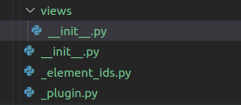

# Building a plugin for visualizing population data

It's no secret that the human world population has been continuosly growing in the last 60 year, reaching a total number of almost 7.8 billion in 2020.

(Source: https://www.worldometers.info/world-population/world-population-by-year/ [2022-06-03])

However, it is rather unknown how this population is distributed over different countries, age groups, gender and urban and rural areas. Moreover, have you ever wondered how high the birth and mortality rate is? What the life expectancy is depending on country and gender?

In this tutorial, we are going to create a Webviz plugin using the new Webviz Layout Framework (WLF) that lets us dive deeper into this topic. As a data source we are going to use the World Bank's 2022 `Population Estimates And Projections` data collection (https://datacatalog.worldbank.org/search/dataset/0037655/Population-Estimates-and-Projections).

## Analyzing the data source

In order to get started, let's have a look at the data source. We have a set of indicators for both areas and single countries in the world with data series from 1960 to 2050. In addition, we also have all those indicators for the whole world. In order to make the plugin less complicated, let's not take into account areas and just concentrate on single countries and the overall world's values.

Let's have a look at the indicators:

-   Age dependency ratio (young, old, % of working-age population)
-   Age population interpolated (male/female, 0-25 years)
-   Birth, death and fertility rates
-   Life expectancy at birth (male/female/total)
-   Mortality rates
-   Net migration
-   Number of deaths
-   Population ages (0-80+, absolute and relative values)
-   Population growth (annual %)
-   Population (male/female/total)
-   Probability of dying among adolescents
-   Rural and urban population (absolute/relative/annual growth)
-   Sex ratio at birth (male births per female births)

Since we don't want to blow up our plugin too much (and not all indicators come with data for each country), we are only going to have a look at the following indicators. Moreover, we are going to categorize them as follows:

-   Birth, death, fertility and life expectancy
    -   Birth indicators
        -   Birth and fertility rates
        -   Life expectancy at birth (male/female/total)
        -   Sex ratio at birth (male births per female
    -   Mortality and death rates
-   Population
    -   Population by ages
        -   Population ages (0-80+, absolute and relative values)
    -   Population indicators
        -   Population growth (annual %)
        -   Population (male/female/total)
        -   Rural and urban population (absolute/relative/annual growth)

The CSV file from the World Bank was adjusted accordingly by removing all unnecessary data.

## Sketching the plugin

After having analyzed the data source, let's start sketching our plugin. We decided to look at a certain set of indicators and we grouped them together. We have two main categories, each of them having two sub categories. In WLF, these categories of indicators can be regarded as different views on the data source. That's why we are going to implement two view groups and four views.

## Implementing the plugin

### Initial setup

Let's get started implementing the plugin. The most important part in the beginning is the structure. A good practice is to create a folder for all the views and one file for storing all the elements' IDs. In addition, we create our `_plugin.py` and `__init__.py`s file (one inside the main and one in the `views` folder).

### Plugin file
