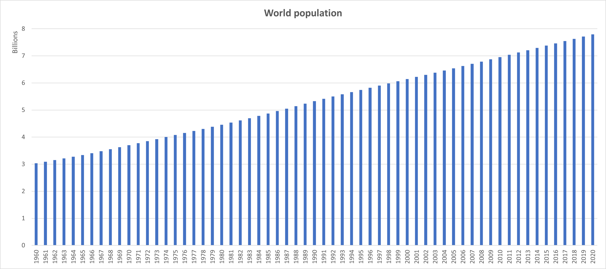
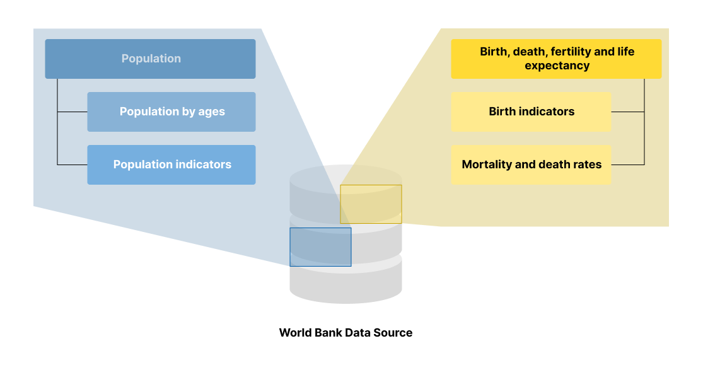
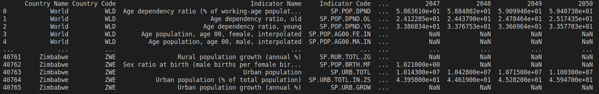
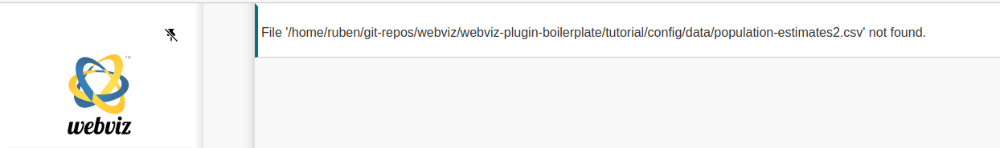
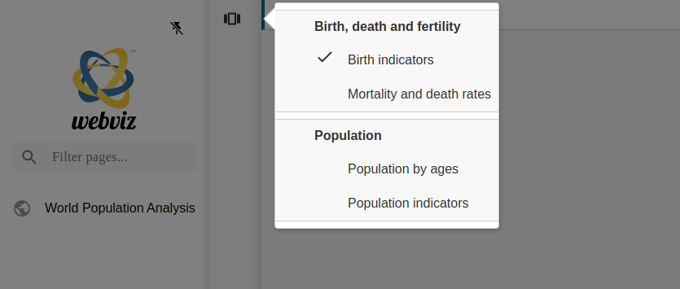

# Building a plugin for visualizing population data

It's no secret that the human world population has been continuosly growing in the last 60 year, reaching a total number of almost 7.8 billion in 2020.


(Source: https://www.worldometers.info/world-population/world-population-by-year/ [2022-06-03])

However, it is rather unknown how this population is distributed over different countries, age groups, gender and urban and rural areas. Moreover, have you ever wondered how high the birth and mortality rate is? What the life expectancy is depending on country and gender?

In this tutorial, we are going to create a Webviz plugin using the new Webviz Layout Framework (WLF) that lets us dive deeper into this topic. As a data source we are going to use the World Bank's 2022 `Population Estimates And Projections` data collection (https://datacatalog.worldbank.org/search/dataset/0037655/Population-Estimates-and-Projections).

## Analyzing the data source

In order to get started, let's have a look at the data source. We have a set of indicators for both areas and single countries in the world with data series from 1960 to 2050. In addition, we also have all those indicators for the whole world. In order to make the plugin less complicated, let's not take into account areas and just concentrate on single countries and the overall world's values.

Let's have a look at the indicators:

-   Age dependency ratio (young, old, % of working-age population)
-   Age population interpolated (male/female, 0-25 years)
-   Birth, death and fertility rates
-   Life expectancy at birth (male/female/total)
-   Mortality rates
-   Net migration
-   Number of deaths
-   Population ages (0-80+, absolute and relative values)
-   Population growth (annual %)
-   Population (male/female/total)
-   Probability of dying among adolescents
-   Rural and urban population (absolute/relative/annual growth)
-   Sex ratio at birth (male births per female births)

Since we don't want to blow up our plugin too much (and not all indicators come with data for each country), we are only going to have a look at the following indicators. Moreover, we are going to categorize them as follows:

-   Birth, death, fertility and life expectancy
    -   Birth indicators
        -   Birth and fertility rates
        -   Life expectancy at birth (male/female/total)
        -   Sex ratio at birth (male births per female birth)
    -   Mortality and death rates
-   Population
    -   Population by ages
        -   Population ages (0-80+, absolute and relative values)
    -   Population indicators
        -   Population growth (annual %)
        -   Population (male/female/total)
        -   Rural and urban population (absolute/relative/annual growth)

## Sketching the plugin

After having analyzed the data source, let's start sketching our plugin. We decided to look at a certain set of indicators and we grouped them together. We have two main categories, each of them having two sub categories. In WLF, these categories of indicators can be regarded as different views on the data source. That's why we are going to implement two view groups and four views.



## Implementing the plugin

### Initial setup

Let's get started implementing the plugin. The most important part in the beginning is the structure. A good practice is to create a folder for all the views and one file for storing all the elements' IDs. In addition, we create our `_plugin.py` and `__init__.py` files (one inside the main plugin and one in the `views` folder; if the plugin is the first one in the project, we also need to add an `__init__.py` file to the top level).

```python
├ population_analysis
│ ├ views
│ │ └ __init__.py
│ ├ __init__.py
│ ├ _element_ids.py
│ ├ _error.py
│ └ _plugin.py
└ __init__.py # if it doesn't already exist
```

### Plugin file

Let's have a look at our `_plugin.py` file. This is going to be the heart and brain of our plugin. It defines the input, imports our data and creates the views and settings. We start with a basic implementation that gives a description and handles the data import.

```python
from typing import Optional, Type, Union
from pathlib import Path

import pandas as pd
from webviz_config import WebvizPluginABC
from dash.development.base_component import Component

from ._error import error

class PopulationAnalysis(WebvizPluginABC):
    """
    This Webviz plugin is serving as a demonstration of how to utilize the new Webviz Layout Framework.
    Step by step, it is created in the respective tutorial: MISSING LINK.

    `Plugin functionality`:
    This plugin imports population data from the World Bank's 2022 `Population Estimates And Projections`
    data collection (https://datacatalog.worldbank.org/search/dataset/0037655/Population-Estimates-and-Projections)
    as a CSV file.
    It provides two view groups with two views each on the data:
    -   Birth, death, fertility and life expectancy
        -   Birth indicators
            -   Birth and fertility rates
            -   Life expectancy at birth (male/female/total)
            -   Sex ratio at birth (male births per female
        -   Mortality and death rates
    -   Population
        -   Population by ages
            -   Population ages (0-80+, absolute and relative values)
        -   Population indicators
            -   Population growth (annual %)
            -   Population (male/female/total)
            -   Rural and urban population (absolute/relative/annual growth)

    `Plugin file structure:`
    * _element_ids - Containing element IDs for all elements
    """

    def __init__(self, path_to_population_data_csv_file: Path) -> None:
        super().__init__()

        self.error_message = ""

        try:
            self.population_df = pd.read_csv(path_to_population_data_csv_file)
        except PermissionError:
            self.error_message = f"Access to file '{path_to_population_data_csv_file}' denied."
            "Please check your path for 'path_to_population_data_csv_file' and make sure your application has permission to access it."
            return
        except FileNotFoundError:
            self.error_message = f"File '{path_to_population_data_csv_file}' not found."
            "Please check your path for 'path_to_population_data_csv_file'."
            return
        except pd.errors.ParserError:
            self.error_message = f"File '{path_to_population_data_csv_file}' is not a valid CSV file."
            return
        except pd.errors.EmptyDataError:
            self.error_message = f"File '{path_to_population_data_csv_file}' is an empty file."
            return
        except Exception:
            self.error_message = f"Unknown exception when trying to read '{path_to_population_data_csv_file}'."
            return

    @property
    def layout(self) -> Union[str, Type[Component]]:
        return error(self.error_message)
```

So, what have we implemented so far? First of all, we have our plugin with its description and its constructor with one argument - the path to our data file.

```python
...
class PopulationAnalysis(WebvizPluginABC):
    """Description..."""
    def __init__(self, path_to_population_data_csv_file: Path) -> None:
    ...
```

In the `__init__` method, we first call the inherited class' `__init__` function before we try to read data from the CSV file given in the argument. If any exception occurs while trying to read the data, we store it in the `self.error_message` member and stop further execution. If everything goes well, `self.population_data` contains our data as a Pandas dataframe and `self.error_message` is an empty string. If not, `self.error_message` contains a description of the error.

```python
        ...
        super().__init__()

        self.error_message = ""

        try:
            self.population_df = pd.read_csv(path_to_population_data_csv_file)
        except PermissionError:
            self.error_message = f"Access to file '{path_to_population_data_csv_file}' denied."
            "Please check your path for 'path_to_population_data_csv_file' and make sure your application has permission to access it."
            return
        except FileNotFoundError:
            self.error_message = f"File '{path_to_population_data_csv_file}' not found."
            "Please check your path for 'path_to_population_data_csv_file'."
            return
        except pd.errors.ParserError:
            self.error_message = f"File '{path_to_population_data_csv_file}' is not a valid CSV file."
            return
        except pd.errors.EmptyDataError:
            self.error_message = f"File '{path_to_population_data_csv_file}' is an empty file."
            return
        except Exception:
            self.error_message = f"Unknown exception when trying to read '{path_to_population_data_csv_file}'."
            return
```

Under normal circumstances, we would not implement the base class's `layout` method. However, in this case, we use it to display our error message if no data could be read. No need to add any views or settings if there is no data. Also, by not throwing an exception in Python but displaying an error message in the plugin in the browser, we make it easier to correct mistakes in the config file without having to rebuild the whole application.

```python
    @property
    def layout(self) -> Union[str, Type[Component]]:
        return error(self.error_message)
```

`error` is a function that we define in an extra file called `_error.py` at the top level of our plugin.

```python
├ > views
├ __init__.py
├ _element_ids.py
├ _error.py
└ _plugin.py
```

This is in order to keep our plugin main file as clean as possible. The `error` function returns an HTML element which wraps and styles our error message.

```python
from dash import html

def error(error_message: str) -> html.Div:
    return html.Div(error_message)
```

Note that we haven't added any style here, but there is the possibility to do so.

Now we have covered all error cases when reading the data. Let's give our plugin a first run and see if the data is correctly read and everything is in place. However, first we need to add our plugin to the `setup.py` file in order for it to be discoverable by Webviz. If you have created this tutorial plugin within an already existing Webviz project, you'll find the `setup.py` file in the project's root folder. Otherwise, you can create the file in your tutorial plugin's root folder and paste the following content:

```python
from setuptools import setup, find_packages

with open("README.md", "r") as fh:
    LONG_DESCRIPTION = fh.read()

TESTS_REQUIRE = ["selenium~=3.141", "pylint", "mock", "black", "bandit"]

setup(
    name="webviz_wlf_tutorial",
    description="Webviz Layout Framework Tutorial",
    long_description=LONG_DESCRIPTION,
    long_description_content_type="text/markdown",
    packages=find_packages(exclude=["tests"]),
    entry_points={
        "webviz_config_plugins": [
            "PopulationAnalyis = webviz_wlf_tutorial.plugins:PopulationAnalysis",
        ]
    },
    install_requires=[
        "webviz-config>=0.1.0",
    ],
    tests_require=TESTS_REQUIRE,
    extras_require={"tests": TESTS_REQUIRE},
    setup_requires=["setuptools_scm~=3.2"],
    python_requires="~=3.6",
    use_scm_version=True,
    zip_safe=False,
    classifiers=[
        "Natural Language :: English",
        "Environment :: Web Environment",
        "Framework :: Dash",
        "Framework :: Flask",
        "Programming Language :: Python",
        "Programming Language :: Python :: 3",
    ],
)
```

The part of the `setup.py` file we need to change is the `entry_points` parameter of the `setup` method call. We'll add our plugin to it:

```python
    ...
    entry_points={
        "webviz_config_plugins": [
            "PopulationAnalyis = webviz_wlf_tutorial.plugins:PopulationAnalysis",
        ]
    }
    ...
```

The syntax is quite simple: on the left hand side of the equal sign (`PopulationAnalysis`) stands the name of our plugin, i.e. the name by which our plugin will be known to Webviz. On the right hand side, we have the path to our plugin class relative to the `setup.py` file (using the Python import syntax).

Now we only have to adjust our `__init__.py` files. Let's start with the one in our plugin folder.

```python
├ population_analysis
│ ├ views
│ │ └ __init__.py
│ ├ __init__.py # <---
│ ├ _element_ids.py
│ ├ _error.py
│ └ _plugin.py
└ __init__.py
```

We want to make our plugin directly accessible from the plugin folder instead of having to refer to the `_plugin.py` file.

```python
from ._plugin import PopulationAnalysis
```

Finally, we want to go even one step further and avoid that our plugin needs to be imported from its folder. We want it to be directly accessible from its parent plugin directory. That's why we adjust the `__init__.py` file in the parent directory.

```python
├ population_analysis
│ ├ views
│ │ └ __init__.py
│ ├ __init__.py
│ ├ _element_ids.py
│ ├ _error.py
│ └ _plugin.py
└ __init__.py # <---
```

```python
from .population_analysis import PopulationAnalysis
```

Moreover, we want to print our dataframe to the console. Hence, we add a temporary line of code to our plugin's `__init__` method:

```python
        ...
        print(self.population_df)
        ...
```

Now, let's finally test our current setup by first installing our new plugin. Open a console in the folder containing the `setup.py` file and make sure you're in the correct environment. Then run:

    pip3 install -e .

We can now create a Webviz config file with our plugin, e.g. in a new folder called `config`:

```python
├ tutorial
│ ├ config
│ │ ├ data
│ │ │ └ population-estimates.csv
│ │ └ population-estimates.yaml
...
```

```yaml
title: World Population Analysis

layout:
    - page: World Population Analysis
      icon: world
      content:
          - PopulationAnalysis:
                path_to_population_data_csv_file: ./data/population-estimates.csv
```

and build it (from a console in our tutorial root folder):

    webviz build ./config/population-estimates.yaml

In the console, we should see an excerpt of the Pandas dataframe with the population data.



... and whats happens if e.g. the our CSV data file cannot be found? If we slightly change the path to the file, we get the following output:



Awesome, now we know that the data is correctly read and that our plugin is working... so far.

Let's continue with the implementation of our plugin. As a reminder, we want to implement two view groups with two views each:

-   Birth, death, fertility and life expectancy
    -   Birth indicators
    -   Mortality and death rates
-   Population
    -   Population by ages
    -   Population indicators

For each of these views we add a new file to our `views` directory.

```python
├ population_analysis
│ ├ views
│ │ ├ birth_death_fertility
│ │ │ ├ __init__.py
│ │ │ ├ _birth_indicators.py
│ │ │ └ _mortatility_death_rates.py
│ │ ├ population
│ │ │ ├ __init__.py
│ │ │ ├ _by_ages.py
│ │ │ └ _indicators.py
```

In each of these files, we create a new class by inheriting from `ViewABC` with our dataframe as argument. The following example can be respectively used for all four files.

```python
import pandas as pd
from webviz_config.webviz_plugin_subclasses import ViewABC

class BirthIndicators(ViewABC):
    def __init__(self, population_df: pd.DataFrame) -> None:
        super().__init__("Birth indicators")

        self.population_df = population_df

```

Now we can add the views to our plugin's `__init__` method:

```python
        ...
        self.add_view(BirthIndicators(self.population_df), ElementIds.BirthDeathFertility.BirthIndicators.ID, ElementIds.BirthDeathFertility.NAME)
        self.add_view(MortalityDeathRates(self.population_df), ElementIds.BirthDeathFertility.MortalityDeathRates.ID, ElementIds.BirthDeathFertility.NAME)

        self.add_view(PopulationByAges(self.population_df), ElementIds.Population.ByAges.ID, ElementIds.Population.NAME)
        self.add_view(PopulationIndicators(self.population_df), ElementIds.Population.Indicators.ID, ElementIds.Population.NAME)
        ...
```

Remember to import the respective views and the `ElementIds` class:

```python
...
from ._element_ids import ElementIds
from ._error import error
from .views import BirthIndicators, MortalityDeathRates, PopulationByAges, PopulationIndicators
...
```

The content of the `_element_ids.py` looks like this:

```python
class ElementIds:
    class BirthDeathFertility:
        NAME = "Birth, death and fertility"

        class BirthIndicators:
            ID = "birth-indicators"

        class MortalityDeathRates:
            ID = "mortality-death-rates"

    class Population:
        NAME = "Population"

        class ByAges:
            ID = "by-ages"

        class Indicators:
            ID = "indicators"
```

Why are we using `ElementIds`? Of course, we could also use strings directly as IDs. However, in order to guarantee consistency and to make it easier to implement changes to names, a class structure like this is beneficial. We are going to extend this file for each ID we are going to need in our plugin.

Having the our views implemented, let's have a look how our plugin looks like.



That does already look promising. In the next sections we are going to implement our views.

### Birth indicators view
